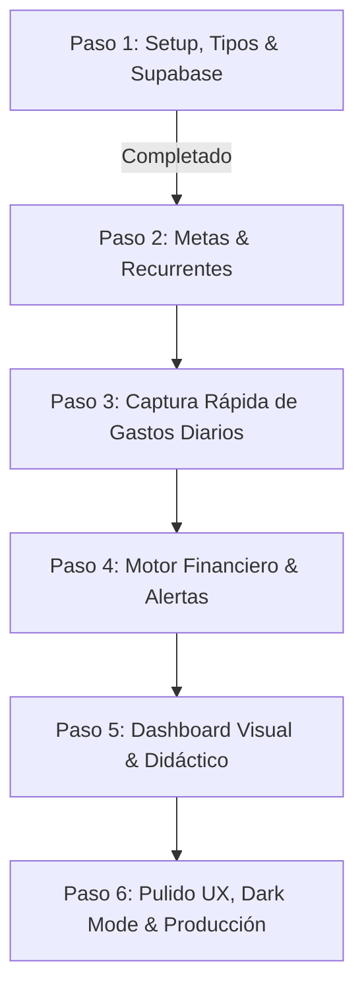

# 📘 CONTEXTO GENERAL DEL PROYECTO: FINANZAS PERSONALES

> **Documento de Contexto Activo, Evolutivo y Maestro**  
> Este archivo contiene la arquitectura completa, reglas de negocio, modelo de datos, especificación detallada de cada paso de desarrollo y estado actual del proyecto. Se actualiza de forma obligatoria tras cada fase o cambio significativo.

---

## 1. REGLAS FUNDAMENTALES Y POLÍTICAS DEL PROYECTO
1. **Verificación sin Explorador Web:**  
   - **ESTRICTAMENTE PROHIBIDO** abrir el navegador para pruebas automatizadas o tomar capturas de pantalla (`browser_subagent` o apertura de ventanas).
   - Toda validación se realiza exclusivamente vía terminal: compilación estática (`npm run build`), análisis estricto de tipos (`tsc --noEmit`), linter (`npm run lint`) y scripts de prueba.
2. **Actualización Continua del Contexto:**  
   - Este archivo (`PROJECT_CONTEXT.md`) se mantiene sincronizado tras cada paso completado, documentando decisiones de diseño, archivos creados/modificados y el estado de avance.
3. **Moneda y Formato:**  
   - 100% en Dólares Estadounidenses (USD - `$`). Utilizar siempre los formateadores centralizados de `lib/utils.ts` (`formatUSD`).
4. **Acceso y Audiencia:**  
   - Aplicación de uso personal directo (single-user), optimizada para desktop y móvil con microinteracciones fluidas.

---

## 2. FILOSOFÍA FINANCIERA Y REGLAS DE NEGOCIO
- **"Págate a ti primero" (Pay Yourself First):**  
  Al comenzar cada ciclo mensual, las cuotas de ahorro de las metas se apartan inmediatamente como un **gasto obligatorio no negociable**.
- **Flujo en Cascada:**  
  $$\text{Saldo Disponible para Variables} = (\text{Ingresos Fijos} + \text{Ingresos Extras}) - \text{Cuotas Obligatorias de Metas} - \text{Gastos Fijos Recurrentes}$$
- **Persistencia de Recurrentes:**  
  Las plantillas de ingresos y gastos fijos persisten automáticamente mes a mes sin requerir recreación manual.
- **Semáforo y Alertas de Presupuesto por Categoría:**  
  - **Normal (Verde):** Consumo $< 80\%$ del límite mensual asignado.
  - **Advertencia (Amarillo):** Consumo $\ge 80\%$ y $\le 100\%$.
  - **Crítico (Rojo):** Consumo $> 100\%$ del límite mensual (sobregiro de presupuesto).

---

## 3. STACK TECNOLÓGICO Y DEPENDENCIAS
- **Framework:** Next.js 16 (App Router) + React 19 + TypeScript 5.
- **Estilos:** Tailwind CSS v4 con paleta oklch, soporte nativo de modo oscuro (`dark`) y utilidades de animación (`tw-animate-css`).
- **Componentes UI:** shadcn/ui (estilo base-nova) con iconos de `lucide-react`.
  - Componentes ya instalados y disponibles en `components/ui/`: `button`, `card`, `badge`, `dialog`, `progress`, `input`, `label`, `select`, `tabs`.
- **Visualización de Datos:** `recharts` (para flujos mensuales, barras y distribución).
- **Persistencia / Base de Datos:** Supabase (`@supabase/supabase-js`) con tipado estricto `Database` generado en `types/database.types.ts`.

---

## 4. MODELO DE DATOS Y DEFINICIONES SQL
El esquema se encuentra definido en `supabase/schema.sql` y mapeado en `types/database.types.ts`:

1. `savings_goals` (Metas de Ahorro):
   - `id`: UUID (PK)
   - `name`: TEXT
   - `target_amount`: NUMERIC(12, 2)
   - `current_amount`: NUMERIC(12, 2) (Default 0.00)
   - `monthly_quota`: NUMERIC(12, 2) (Cuota obligatoria mensual no negociable)
   - `term_type`: TEXT ('short' | 'medium' | 'long')
   - `deadline`: DATE (Opcional)
   - `color`: TEXT (Default '#10b981')
   - `created_at`: TIMESTAMPTZ

2. `categories` (Categorías de Clasificación):
   - `id`: UUID (PK)
   - `name`: TEXT
   - `type`: TEXT ('income' | 'fixed_expense' | 'variable_expense')
   - `monthly_budget_limit`: NUMERIC(12, 2) (Límite mensual para variables)
   - `color`: TEXT
   - `icon`: TEXT (Nombre de icono Lucide)
   - `created_at`: TIMESTAMPTZ

3. `recurring_templates` (Plantillas de Fijos Recurrentes):
   - `id`: UUID (PK)
   - `category_id`: UUID (FK -> categories.id)
   - `name`: TEXT
   - `amount`: NUMERIC(12, 2)
   - `type`: TEXT ('income' | 'fixed_expense')
   - `day_of_month`: INTEGER (1 - 31)
   - `is_active`: BOOLEAN (Default true)
   - `created_at`: TIMESTAMPTZ

4. `transactions` (Movimientos y Gastos Diarios / Extras):
   - `id`: UUID (PK)
   - `category_id`: UUID (FK -> categories.id, Nullable si va directo a meta)
   - `goal_id`: UUID (FK -> savings_goals.id, Nullable si es gasto regular)
   - `description`: TEXT
   - `amount`: NUMERIC(12, 2)
   - `date`: DATE (Default CURRENT_DATE)
   - `is_extra`: BOOLEAN (Indica si es ingreso o gasto no planificado)
   - `created_at`: TIMESTAMPTZ

---

## 5. ESTRUCTURA ACTUAL DEL PROYECTO
```
├── app/
│   ├── globals.css          # Estilos globales, variables CSS, Tailwind v4 y dark mode
│   ├── layout.tsx           # Shell raíz con metadatos, idioma y clase 'dark' activa
│   └── page.tsx             # Vista inicial de estado y bienvenida arquitectónica
├── components/
│   ├── dashboard/           # Componentes del dashboard (Paso 5)
│   ├── forms/               # Formularios modales y drawers (Pasos 2 y 3)
│   └── ui/                  # Componentes base shadcn (button, card, dialog, progress, etc.)
├── hooks/                   # Custom hooks de cálculo financiero y suscripción (Paso 4)
├── lib/
│   ├── supabase.ts          # Cliente singleton tipado con fallback resiliente
│   └── utils.ts             # Función cn() y formateadores formatUSD(), formatPercentage()
├── supabase/
│   └── schema.sql           # DDL completo con índices y 11 categorías semilla
├── types/
│   └── database.types.ts    # Tipos TypeScript exactos y modelos de flujo financiero
├── .env.local               # Configuración local de desarrollo
├── .env.local.example       # Plantilla de variables de entorno para Supabase
├── components.json          # Configuración del CLI de shadcn
├── package.json             # Dependencias instaladas y scripts
└── PROJECT_CONTEXT.md       # Contexto activo y pasos de producción del programa
```

---

## 6. ROADMAP MAESTRO Y PASOS DE PRODUCCIÓN DETALLADOS

A continuación se detalla cada fase del ciclo de vida del proyecto para garantizar continuidad perfecta entre sesiones de desarrollo:



### ✅ PASO 1: Setup, Tipos de Datos y Cliente de Supabase (ESTADO: COMPLETADO)
- **Objetivo:** Preparar la base del proyecto Next.js 16, TypeScript, Tailwind CSS v4, shadcn/ui y la capa de datos.
- **Entregables:**
  - `types/database.types.ts`: Esquema completo de TypeScript para las 4 tablas y modelos de flujo en cascada.
  - `lib/supabase.ts`: Cliente singleton tipado con manejo seguro de variables de entorno y fallbacks.
  - `supabase/schema.sql`: Script DDL para PostgreSQL con índices y categorías predefinidas.
  - `lib/utils.ts`: Formateadores monetarios `formatUSD` y porcentajes `formatPercentage`.
  - Instalación de componentes shadcn: `card`, `progress`, `dialog`, `badge`, `button`, `input`, `label`, `select`, `tabs`.
  - `PROJECT_CONTEXT.md`: Reglas del proyecto creadas y actualizadas.
  - Verificación estática con `npm run build` (0 errores).

---

### 🟡 PASO 2: Módulo de Metas de Ahorro y Configuración de Recurrentes (ESTADO: SIGUIENTE A EJECUTAR)
- **Objetivo:** Permitir al usuario crear, editar, listar y gestionar sus metas de ahorro obligatorias y sus plantillas de ingresos/gastos fijos que persisten mes a mes.
- **Componentes y Archivos a Crear/Modificar:**
  1. `components/forms/GoalFormDialog.tsx`: Modal para crear/editar metas de ahorro:
     - Nombre de la meta, monto objetivo (`target_amount`), monto actual inicial (`current_amount`).
     - Cuota mensual obligatoria (`monthly_quota` calculada automáticamente o editable).
     - Plazo (`term_type`: 'short' < 1 año, 'medium' 1-3 años, 'long' > 3 años).
     - Fecha límite estimada (`deadline`) y selector de color.
  2. `components/dashboard/SavingsGoalsList.tsx`: Visualización de metas agrupadas por plazo con:
     - Barras de progreso visuales (`Progress` de shadcn).
     - Cuota mensual destacada como retención obligatoria ("Págate a ti primero").
     - Estado de cumplimiento y tiempo estimado para completar la meta.
  3. `components/forms/RecurringFormDialog.tsx`: Modal para crear/editar plantillas recurrentes:
     - Tipo: Ingreso Fijo (sueldo, renta) o Gasto Fijo (alquiler, servicios, seguro).
     - Categoría asociada (`category_id`), descripción/nombre, monto en USD y día de cobro/pago (`day_of_month` 1-31).
     - Switch/checkbox para activar/desactivar (`is_active`).
  4. `components/dashboard/RecurringTemplatesList.tsx`: Lista organizada de plantillas recurrentes con totalizadores automáticos de ingresos fijos proyectados y gastos fijos obligatorios.
  5. `lib/services/goalsService.ts` y `lib/services/recurringService.ts`: Servicios para interactuar con Supabase (CRUD) con manejo de errores y fallback a almacenamiento local si no hay conexión activa.
- **Criterio de Verificación:** Compilación limpia con `npm run build`, tipado sin errores con `tsc --noEmit`.

---

### ⚪ PASO 3: Captura Rápida de Gastos Diarios e Ingresos Extras (ESTADO: PENDIENTE)
- **Objetivo:** Implementar una experiencia de registro ultrarrápida (< 5 segundos), optimizada tanto para dispositivos móviles como escritorio.
- **Componentes y Archivos a Crear/Modificar:**
  1. `components/forms/QuickTransactionDrawer.tsx`: Modal o Drawer deslizante para registrar transacciones:
     - Teclado/Input numérico grande y claro para monto en USD.
     - Selector rápido de categorías con iconos Lucide y colores correspondientes.
     - Toggle para indicar si es "Gasto Variable" o "Ingreso Extra" (`is_extra = true`).
     - Selector opcional para abonar directamente a una meta de ahorro (`goal_id`).
     - Campo de descripción rápida y fecha (por defecto `CURRENT_DATE`).
  2. Botón flotante o de acceso directo rápido ("+ Registrar Movimiento") siempre accesible en la barra superior/móvil.
  3. `lib/services/transactionsService.ts`: CRUD de transacciones con inserción optimista.
- **Criterio de Verificación:** `npm run build` sin errores, pruebas de validación de campos obligatorios mediante consola.

---

### ⚪ PASO 4: Motor de Cálculo Financiero y Lógica de Alertas (ESTADO: PENDIENTE)
- **Objetivo:** Servicios y custom hooks reactivos que ejecuten en tiempo real la cascada financiera y calculen las alertas presupuestarias por categoría.
- **Componentes y Archivos a Crear/Modificar:**
  1. `hooks/useFinancialSummary.ts`: Custom hook que procesa:
     - Total Ingresos = Ingresos Fijos Activos + Ingresos Extras del mes actual.
     - Ahorro Obligatorio Retenido = Suma de cuotas mensuales (`monthly_quota`) de todas las metas activas.
     - Gastos Fijos = Suma de plantillas activas de gastos fijos.
     - Saldo Disponible para Variables = Total Ingresos - Ahorro Obligatorio - Gastos Fijos.
     - Gastos Variables Ejecutados = Suma de transacciones del mes asignadas a categorías variables.
     - Saldo Remanente Real = Saldo Disponible para Variables - Gastos Variables Ejecutados.
  2. `hooks/useBudgetAlerts.ts`: Custom hook que evalúa cada categoría de gasto variable:
     - Calcula porcentaje consumido: `(gastado / monthly_budget_limit) * 100`.
     - Determina semáforo:
       - `normal` (< 80%): Verde
       - `warning` (>= 80% y <= 100%): Amarillo/Ámbar
       - `critical` (> 100%): Rojo/Destructive
  3. Alertas didácticas y banners preventivos cuando una categoría entra en advertencia o sobregiro.
- **Criterio de Verificación:** Pruebas unitarias/scripts de verificación matemática con `npm run build`.

---

### ⚪ PASO 5: Dashboard Principal Altamente Visual y Didáctico (ESTADO: PENDIENTE)
- **Objetivo:** Unificar todos los módulos en una pantalla principal de alto impacto visual, intuitiva y didáctica.
- **Componentes y Archivos a Crear/Modificar:**
  1. `components/dashboard/HeaderMetrics.tsx`:
     - Card de Saldo Disponible en Tiempo Real (métrica héroe).
     - Card de Fondo Total en Metas de Ahorro.
     - Card de Gastos Fijos y Variables Totales.
  2. `components/dashboard/CashflowChart.tsx`:
     - Gráfico interactivo con Recharts que ilustra el flujo mensual:
       `Ingresos Totales` vs `(Ahorro Retenido + Fijos)` vs `Variables Gastados`.
  3. `components/dashboard/CategoryBudgetGrid.tsx`:
     - Tarjetas de cada categoría con barra de consumo progresiva, indicador del semáforo (Verde, Amarillo, Rojo) y monto restante en USD.
  4. `components/dashboard/RecentTransactionsTable.tsx`:
     - Historial de movimientos recientes con filtros por tipo (ingreso/gasto), categoría y fecha.
  5. `app/page.tsx`: Reemplazo del placeholder por el Dashboard operativo completo.
- **Criterio de Verificación:** `npm run build` sin errores, verificación de renderizado responsivo.

---

### ⚪ PASO 6: Pulido de UX, Dark Mode, Skeletons y Despliegue a Producción (ESTADO: PENDIENTE)
- **Objetivo:** Llevar la aplicación a estándares de producción finales (estabilidad, accesibilidad, feedback visual).
- **Entregables:**
  1. Estados de carga elegantes (`Skeleton` de shadcn) durante la sincronización con Supabase.
  2. Empty states didácticos con botones de acción ("Aún no tienes metas de ahorro. Crea tu primera meta aquí").
  3. Soporte pulido de Modo Claro / Modo Oscuro con transiciones suaves.
  4. Configuración de producción para despliegue (Vercel o Netlify):
     - Configuración de variables de entorno de producción.
     - Verificación de cabeceras de seguridad y caché en `next.config.ts`.
     - Guía paso a paso para desplegar y enlazar el proyecto con la base de datos de Supabase en producción.
- **Criterio de Verificación:** `npm run build` en modo producción, validación de linting `npm run lint`.

---

## 7. GUÍA DE CONTINUIDAD PARA EL DESARROLLADOR / AGENTE
Al retomar el proyecto en cualquier momento, el agente o desarrollador debe seguir esta secuencia:
1. **Leer `PROJECT_CONTEXT.md`:** Identificar en qué paso se encuentra el roadmap (revisar la tabla de la Sección 8).
2. **Respetar la Prohibición del Navegador:** Nunca ejecutar navegadores visuales ni tomar screenshots. Probar todo con `npm run build` y la consola.
3. **Mantener la Moneda en USD:** Usar `formatUSD()` de `lib/utils.ts`.
4. **Respetar la Filosofía:** El ahorro de las metas se resta antes de los gastos variables.
5. **Actualizar este archivo:** Al culminar el paso en desarrollo, actualizar la tabla y el changelog de `PROJECT_CONTEXT.md`.

---

## 8. TABLA RESUMEN DEL ESTADO DEL ROADMAP

| Paso | Descripción | Estado | Dependencias Clave |
|---|---|---|---|
| **Paso 1** | Setup, Tipos de Datos y Cliente de Supabase | 🟢 Completado | Next.js 16, Tailwind v4, Supabase, shadcn/ui |
| **Paso 2** | Módulo de Metas de Ahorro y Configuración de Recurrentes | 🟢 Completado | `savings_goals`, `recurring_templates`, Dialogs |
| **Paso 3** | Captura Rápida de Gastos Diarios e Ingresos Extras | 🟢 Completado | `transactions`, QuickTransactionDrawer |
| **Paso 4** | Motor de Cálculo Financiero y Lógica de Alertas | 🟢 Completado | `useFinancialSummary`, `useBudgetAlerts` |
| **Paso 5** | Dashboard Principal Altamente Visual y Didáctico | 🟢 Completado | Recharts, HeaderMetrics, CategoryBudgetGrid |
| **Paso 6** | Pulido de UX, Dark Mode, Skeletons y Producción | 🟢 Completado | Skeletons, Vercel/Netlify Deploy, Tests |

---

## 9. REGISTRO HISTÓRICO DE CAMBIOS (CHANGELOG)
- **2026-09-12 (Paso 1 - Completado):**
  - Inicialización del proyecto Next.js 16 (App Router) con TypeScript y Tailwind CSS v4 en la raíz.
  - Regla de oro formalizada: Prohibición de abrir explorador web para pruebas o capturas de pantalla.
  - Definición de `types/database.types.ts` con las 4 tablas y modelos del flujo en cascada.
  - Creación del cliente resiliente `lib/supabase.ts`, `.env.local` y `.env.local.example`.
  - Instalación de componentes shadcn/ui (`card`, `progress`, `dialog`, `badge`, `button`, `input`, `label`, `select`, `tabs`) y utilidades en `lib/utils.ts`.
  - Creación del esquema SQL relacional en `supabase/schema.sql` con claves foráneas, índices y semillas.
  - Verificación exitosa de compilación estática vía consola con `npm run build` (0 errores).
- **2026-09-13 (Especificación de Pasos de Producción):**
  - Ampliación exhaustiva de la Sección 6 en `PROJECT_CONTEXT.md` con la especificación técnica completa de los Pasos 2, 3, 4, 5 y 6.
  - Inclusión de la Guía de Continuidad para Agentes y Desarrolladores para garantizar que cualquier sesión futura continúe la implementación sin ambigüedades.
- **2026-09-13 (Finalización a Producción - Arquitectura Multi-Agente en Paralelo):**
  - `[ADMIN]`: Definición de contratos TypeScript `types/contracts.ts` y orquestación unificada.
  - `[PERSIST]`: Implementación de `storageFallback.ts` con datos demo ($900 USD ingresos / $600 USD gastos) y servicios CRUD tipados (`categoriesService`, `goalsService`, `recurringService`, `transactionsService`).
  - `[ENGINE]`: `FinanceContext.tsx`, hook `useFinancialSummary` con cálculo estricto de cascada "Págate a ti primero" y `useBudgetAlerts` con semáforos por categoría.
  - `[FORMS]`: `GoalFormDialog.tsx`, `RecurringFormDialog.tsx`, `QuickTransactionDrawer.tsx` (<5 seg) y `QuickActionTrigger.tsx`.
  - `[DASH]`: Dashboard con navegación por pestañas (*Tabs*), `HeaderMetrics.tsx`, gráfico interactivo Recharts `CashflowChart.tsx`, `CategoryBudgetGrid.tsx`, `SavingsGoalsList.tsx`, `RecurringTemplatesList.tsx` y `RecentTransactionsTable.tsx`.
  - `[QA-UX]`: `skeleton.tsx`, `EmptyState.tsx`, `BudgetAlertBanner.tsx` y guía de despliegue en `README.md`.
  - `[ADMIN]`: Integración final en `app/page.tsx`, verificación terminal estricta (`tsc --noEmit`, `npm run lint`, `npm run build`) con 0 errores y 100% páginas estáticas generadas.
